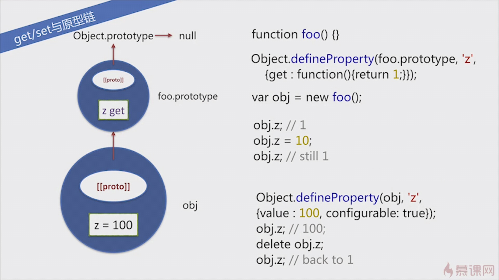
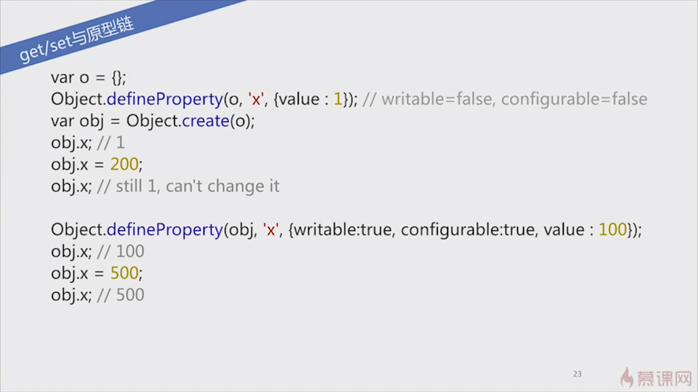

## 删除对象的某个属性
    delete obj.z;

- - -
## 对象创建
    let obj = Object.create({x:1}); //this指向是{x:1}
    obj.x //1
    type of obj.toString //"function"

    obj --> {x:1} --> Object.prototype --> null

    let obj = Object.create(null);
    type of obj.toString //"undefined"

    obj -->  null

- - -
## 属性操作
`Object.prototype` 是禁止删除的。

用`var /let` 显示创建的变量是不能被 `delete` 给删除的。

但是如果是隐式创建的就可以被删除：

    name = 'winter';
    window.name = 'winter';
    delete name; //true

toString 等原型链上的属性是不可被枚举的。

`obj != undefined` 包含了 `!== undefined` 和 `!== null`;

- - -
## javascript 的 get/set 方法
属性`getter/setter`方法，用关键字`get` `set` 来定义的方法,也是用`,`来分割

    let man = {
        name:'winter',
        weibo:'@winter',
        get age() {
            return new Date().getFullYear() - 1992;
        },
        set age(val) {
            console.log('age:' + val);
        }
    }

    console.log(man.age) //25
    man.age = 100; //是方法，会输出"age:100"

- - -
如果val是number，那么就相当于什么也不做。如果不是number，那么就尝试转换成number

        val = +val
    
如果val ='abc' , val=+val会得到NaN
- - -
## get/set 方法与原型链

