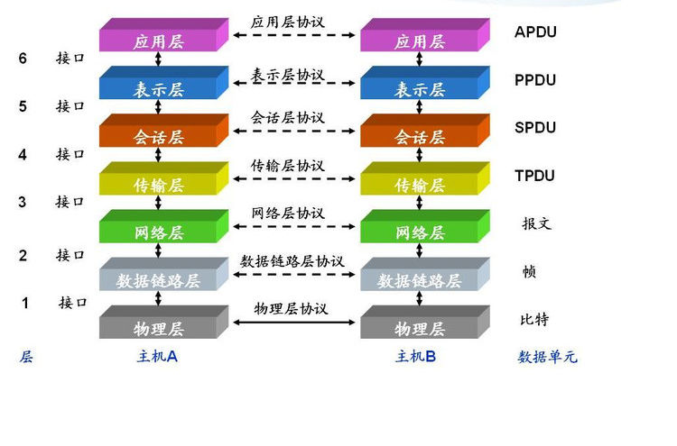
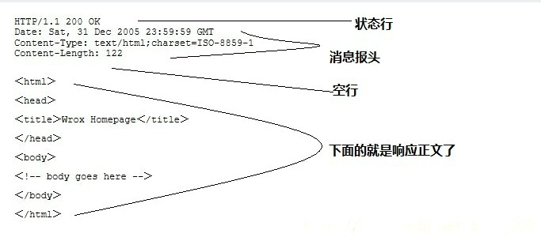

## 一次典型的HTTP会话

### Htttp是典型的CS(client-server)协议，一次典型的http会话主要包含以下几个步骤：
- 客户端建立TCP连接
- 客户端发送请求并等待
- 服务器发送响应
- 重复执行2,3步(可选，http1.1后支持此功能)

### 建立连接
HTTP打开链接实际上是建立一条传输层的TCP连接。浏览器默认的端口是80，当然端口为80时可以省略，不过端口也可以选择为8080等。

### 客户端发送请求
以访问百度为例，我们在访问百度首页时，客户端（浏览器）发送的请求为如下：

### 服务器返回响应
同样是百度首页，现在搜索了一个关键词，服务器返回的相应如下：

其中，响应体包括“状态行”，“消息报头”，“空行”，“响应数据”几部分。

状态行返回信息格式为：协议版本+状态码+状态码信息
